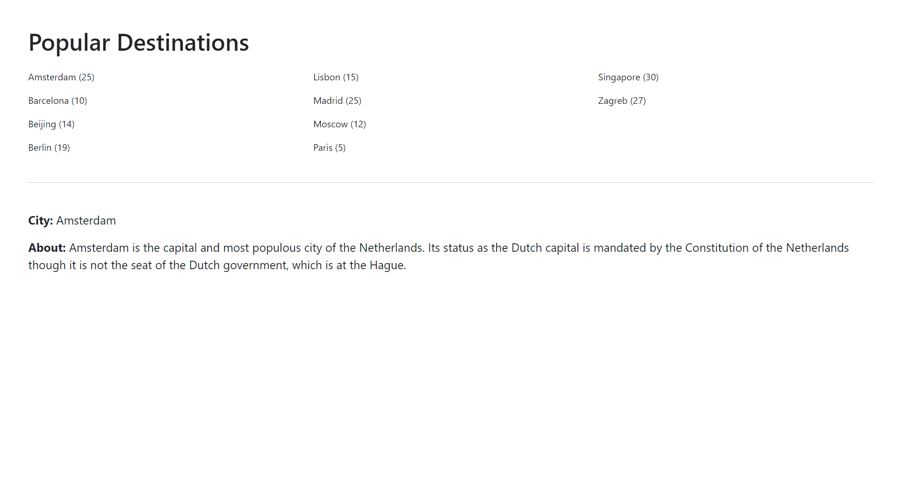

# Take Home Assignment for POS
This is an assessment-project for POS for FrontEnd Developer role.

This project was generated with [Angular CLI](https://github.com/angular/angular-cli).

## Screenshot of Finished Product

---

## What I built?
A very simple web-app which is fetching data from the provided JSON file and displaying it in a 3 column layout. Users can click on the city and get additional info about it. The app implements basic routing. The app is responsive and supports all screen resolutions.

## How to run/test the project?
1. Navigate to project directory and run `npm i`
2. Run `ng serve` for dev server.
3. Navigate to `http://localhost:4200/`. To chose a custom port `ng serve --port 4201`

## Build
Run `ng build` to build the project. The build artifacts will be stored in the `dist/` directory.

## Running unit tests
Run `ng test` to execute the unit tests via [Karma](https://karma-runner.github.io).

## Additional Notes:
Although the app is completely responsive and supports all screen resolutions, there is room for improvement. For example, make the content look even better on larger screens. Other improvements that could be made includes adding more styles (more colours & enhance UI) and Lazy Loading the modules as the app grows. The folder strcuture I have used is based on the scope and size of this project, as the project grows in size, the folder structure can be changed.

Libraries Used: 
1. Bootstrap/Ng-Bootstrap
